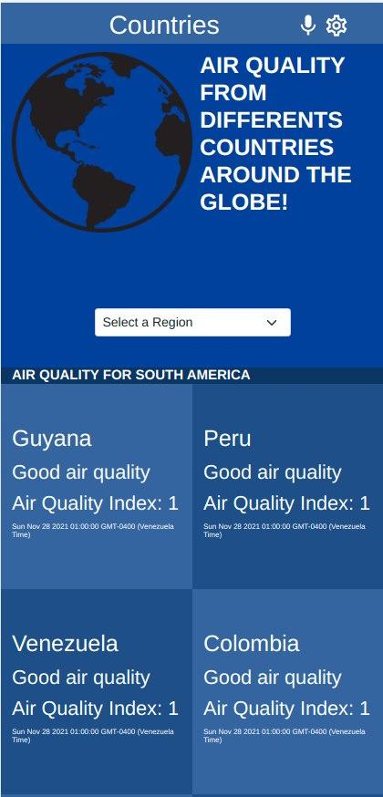

# Pollution Metrics

Microverse capstone react/redux project<br>

This apps is a two pages feature app. The objetive of this app is to get air pollution data from countries all around the world and filter such countries by region.<br>
The first page show the air quality index (AQI) of each country in the filtered region, and the timestamp of when the query was made. <br>
The user is able to click in each of the countries to enter in the details page. This page shows the AQI and the components and particles present in the air in the moment when the query was made.

## App appereance



## Built with

- React
- Redux
- Npn as package manager

## Setup

```
git clone https://github.com/alvp01/book-store.git
cd book-store
npm install
npm start
```
**Note: check the react readme below for more information 👇**

<details>
  <summary>Create React App documentation</summary>

## Getting Started with Create React App

This project was bootstrapped with [Create React App](https://github.com/facebook/create-react-app).

### Available Scripts

In the project directory, you can run:

#### `npm start`

Runs the app in the development mode.\
Open [http://localhost:3000](http://localhost:3000) to view it in the browser.

The page will reload if you make edits.\
You will also see any lint errors in the console.

#### `npm test`

Launches the test runner in the interactive watch mode.\
See the section about [running tests](https://facebook.github.io/create-react-app/docs/running-tests) for more information.

#### `npm run build`

Builds the app for production to the `build` folder.\
It correctly bundles React in production mode and optimizes the build for the best performance.

The build is minified and the filenames include the hashes.\
Your app is ready to be deployed!

See the section about [deployment](https://facebook.github.io/create-react-app/docs/deployment) for more information.

#### `npm run eject`

**Note: this is a one-way operation. Once you `eject`, you can’t go back!**

If you aren’t satisfied with the build tool and configuration choices, you can `eject` at any time. This command will remove the single build dependency from your project.

Instead, it will copy all the configuration files and the transitive dependencies (webpack, Babel, ESLint, etc) right into your project so you have full control over them. All of the commands except `eject` will still work, but they will point to the copied scripts so you can tweak them. At this point you’re on your own.

You don’t have to ever use `eject`. The curated feature set is suitable for small and middle deployments, and you shouldn’t feel obligated to use this feature. However we understand that this tool wouldn’t be useful if you couldn’t customize it when you are ready for it.

### Learn More

You can learn more in the [Create React App documentation](https://facebook.github.io/create-react-app/docs/getting-started).

To learn React, check out the [React documentation](https://reactjs.org/).

#### Code Splitting

This section has moved here: [https://facebook.github.io/create-react-app/docs/code-splitting](https://facebook.github.io/create-react-app/docs/code-splitting)

#### Analyzing the Bundle Size

This section has moved here: [https://facebook.github.io/create-react-app/docs/analyzing-the-bundle-size](https://facebook.github.io/create-react-app/docs/analyzing-the-bundle-size)

#### Making a Progressive Web App

This section has moved here: [https://facebook.github.io/create-react-app/docs/making-a-progressive-web-app](https://facebook.github.io/create-react-app/docs/making-a-progressive-web-app)

#### Advanced Configuration

This section has moved here: [https://facebook.github.io/create-react-app/docs/advanced-configuration](https://facebook.github.io/create-react-app/docs/advanced-configuration)

#### Deployment

This section has moved here: [https://facebook.github.io/create-react-app/docs/deployment](https://facebook.github.io/create-react-app/docs/deployment)

#### `npm run build` fails to minify

This section has moved here: [https://facebook.github.io/create-react-app/docs/troubleshooting#npm-run-build-fails-to-minify](https://facebook.github.io/create-react-app/docs/troubleshooting#npm-run-build-fails-to-minify)

</details>
<br>

## After cloning

After cloning go to [OpenWeather](https://openweathermap.org/), register and verify the email. You will get an API key in your inbox.
Then, create a .env in the root folder of the project and create a variable like this: <br> `APP_REACT_API_KEY=<your-key>` (without brackets).

## Acknowledgements

- [Nelson Sakwa](https://www.behance.net/gallery/31579789/Ballhead-App-(Free-PSDs)) for the design.
- [OpenWeather](https://openweathermap.org/) for the API.

## Video link


## Author

👤 **Abel**
- Github: [@alvp01](https://github.com/alvp01)
- Twitter: [@alvp01](https://twitter.com/alvp01)
- Linkedin: [Abel Lavieri](https://www.linkedin.com/in/abel-lavieri/)

## 🤝 Contributing

Contributions, issues and feature requests are welcome!

Feel free to check the [issues page](https://github.com/alvp01/leader-board-project/issues)

## 📝 License

This project is [MIT](./MIT.md) licensed.